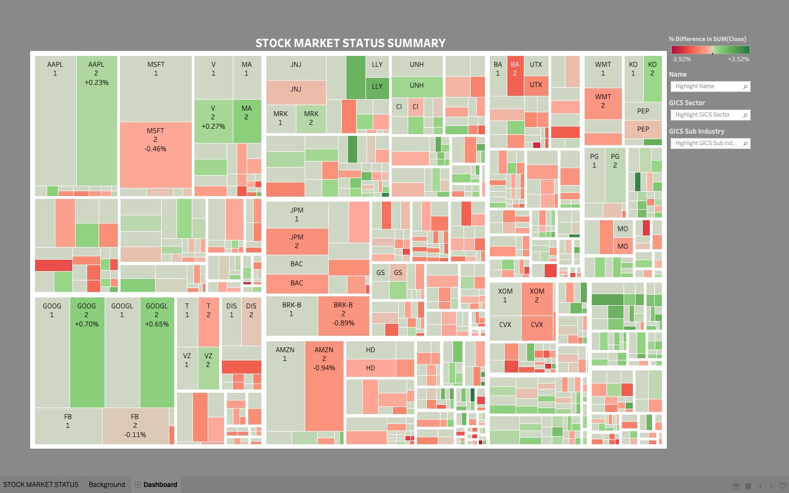

# stock_market_status_summary_tableau_dashboard

<h3>This project includes the data analysis related to stock market data using Tableau Desktop and results are visualized in the form of a Tableau Dashboard.</h3>

<h3> This Tableau Dashboard is inspired and learned from the tableau public link "https://public.tableau.com/app/profile/dorian.barosan/viz/StockMarketOverview-NestedTreemap/StockMarketTreemap" and recreated as part of the Tableau learning journey.

 
 
 

